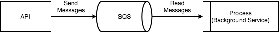

# DotNet Background Jobs And Amazon SQS & SNS
- Read messages from Amazon SQS and then run Background Job
- Amazon SNS: Publish message to Email

## Prerequisite
+ Asp Net Core 3.0
+ Entity Framework
+ Docker & Docker Compose
+ Amazon SQS
+ Amazon SNS
+ Hangfire for running Jobs
+ Redis(Using Hangfire)

### Requirements
+ Add AWS Key Environments into docker-compose file
+ Create a Queue(MyQueue1) in SQS
+ Create a Topic(MyTopic) in SNS
+ Create a AWS Cognito

### Issue
+ Need to add Aws access Key and Aws Secret Key in SnsMessage file.

### Notes
+ AWS Congito:
    - Using OpenId: Error: The system doesn't understand the request
        - Need to create a domain name in AWS Cognito
    - Using JWT Bearer:
        - Add `app.UseAuthentication();` berfore `app.UseAuthorization();` in startup.cs file

### Overview
+ 

### Reference
+ [SQS Sample](https://github.com/awslabs/aws-sdk-net-samples/blob/master/ConsoleSamples/AmazonSQS_Sample/AmazonSQS_Sample/Program.cs)
+ [Queue Processing with Worker Service](https://medium.com/@nickfane/queue-processing-with-net-core-worker-services-eaccff28ba69)
+ [Authentication in ASP.NET Core Web API with Amazon Cognito](http://snevsky.com/blog/dotnet-core-authentication-aws-cognito)
+ [OpenId Connect Authorization with AWS Cognito](https://medium.com/@robert.broeckelmann/openid-connect-authorization-code-flow-with-aws-cognito-246997abd11a)